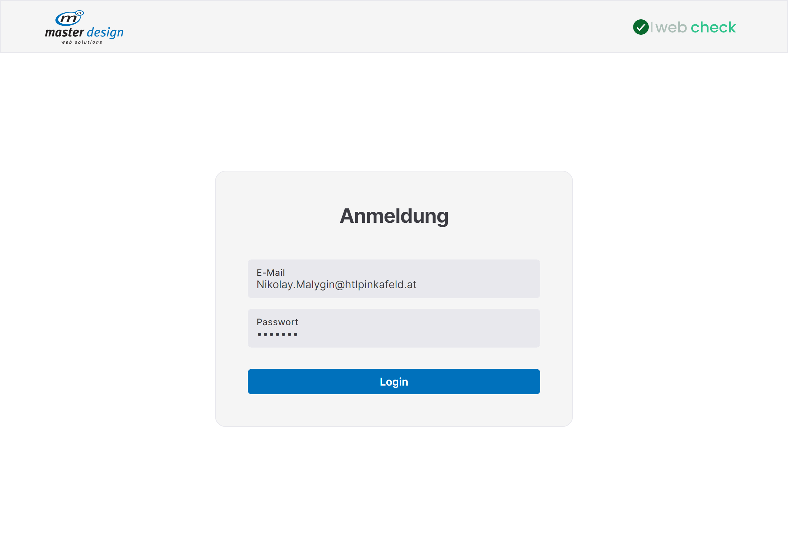
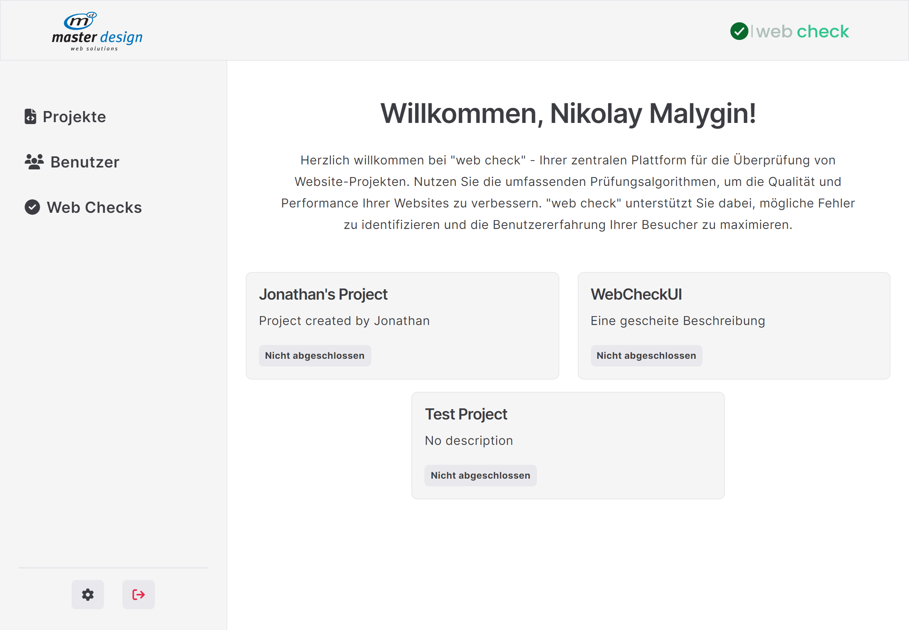
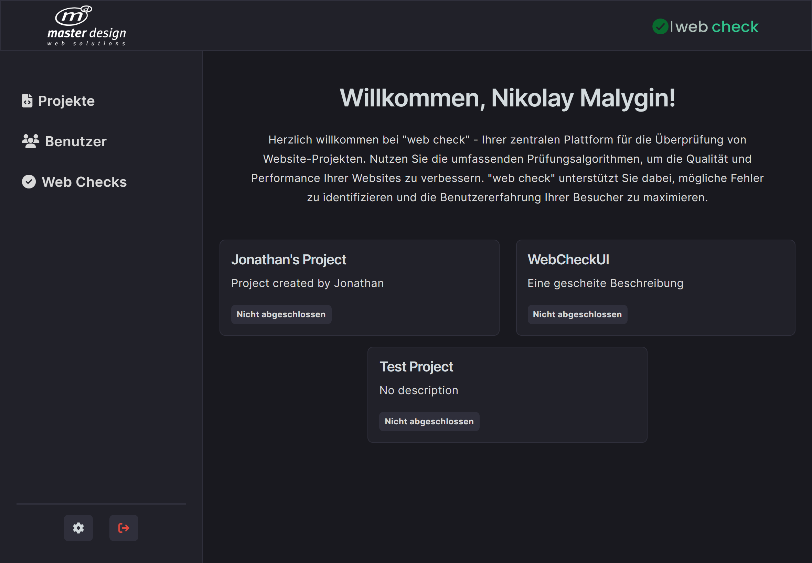
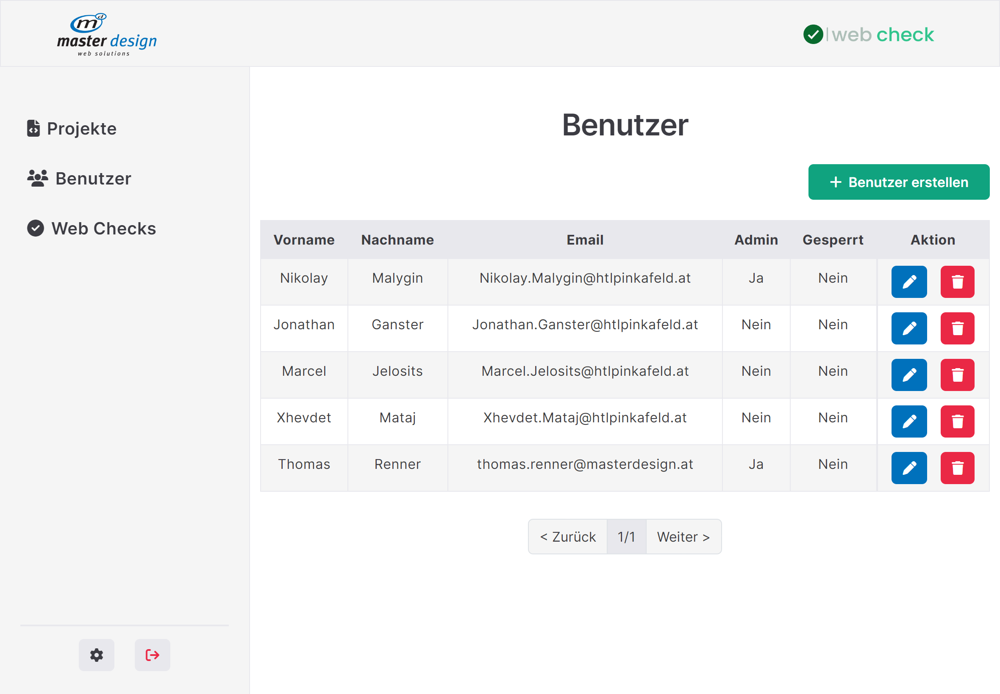
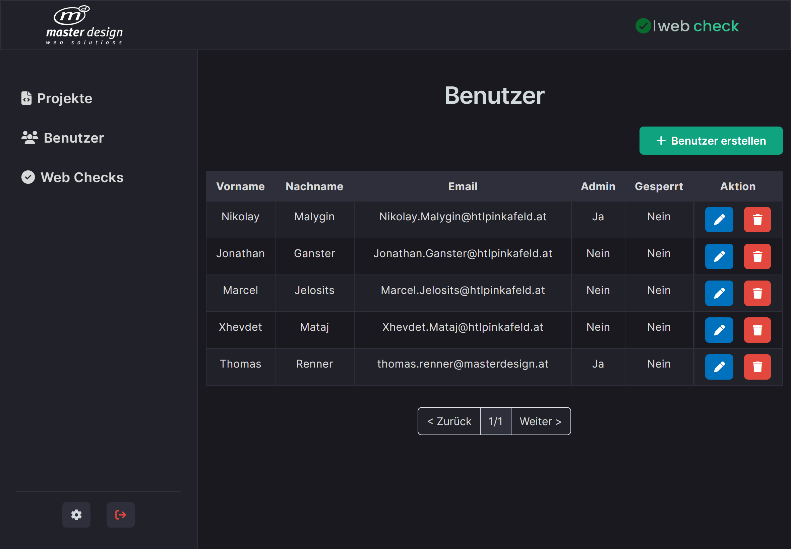
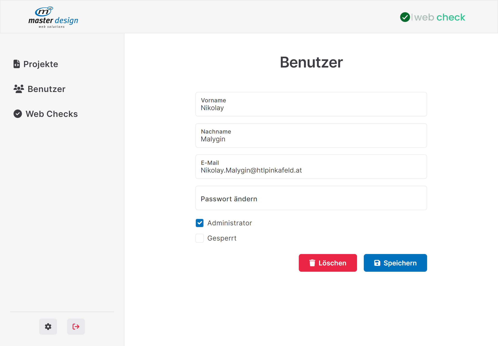
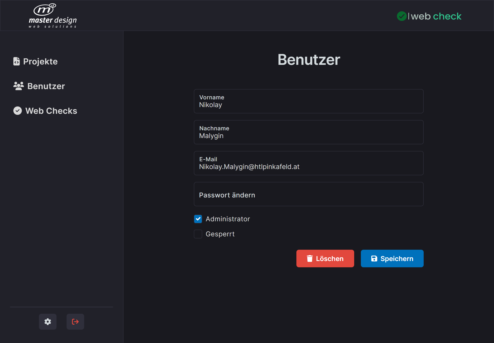
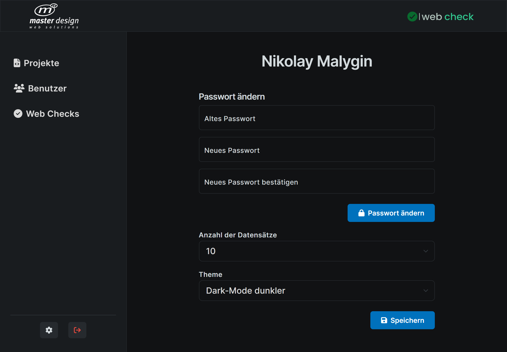
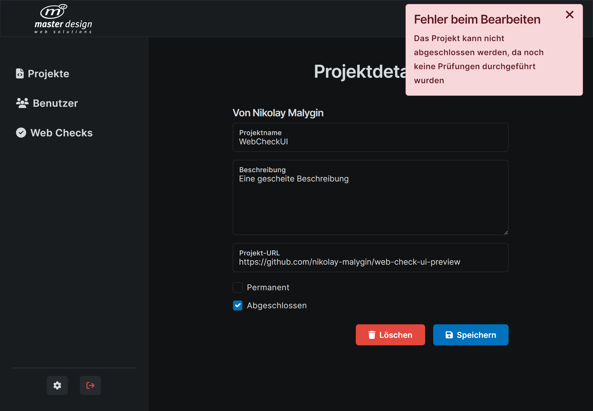

# ✅ web check - Frontend

This repository contains the frontend implementation of the diploma project in collaboration with [master design gmbh](https://www.masterdesign.at/).

web check is a web application designed to facilitate the testing of website projects.
The primary goal is to provide employees of master design with a centralized platform for checking the quality and performance of their websites.

In the upcoming 5th-grade (next school year), the functionality for checking projects using **12 different API tools** will be implemented, further enhancing the capabilities of the platform.

## ⚙️ Tech Stack

-   `React JS` for building UI with 🍰 [FSD (Feature-Sliced Design)](https://feature-sliced.design/) as frontend architecture
-   `React-Query` for efficient and responsive data fetching
-   `Bootstrap 5` for responsive design for various devices
-   `JWT (JSON Web Tokens)` as a method for secure user authentication

## 🌟 Key Features

-   `User Authentication and Authorization`

    - Login functionality

-   `Website Project Management`

    - Allows users to create, update, and delete website projects
    - Displaying project data in a customizable data grid

-   `User Management`

    - Allows administrators to register and delete users
    - Displaying user data in a customizable data grid

-   `Website Check Management`
	- Allows administrators to create, update, and delete website checks for projects
    - Displaying website checks data in a customizable data grid

- `Checking Website Projects` **(⚠️Will be implemented next year⚠️)**
	- Allows users to check the quality and performance of their websites using using **12 different API tools**
	- Saving the results of website checks in the database
	- A user-friendly display of the website check results on a dedicated page
	- Allows users to finalize a project after successful completion of website checks

-  `Dark Mode Support`
    - Enjoy the application in both light and dark modes

## 📸 Screenshots

-   `Login Screen`

-   `Welcome Screen (Light Mode)`

-   `Welcome Screen (Dark Mode)`

-   `User Data (Light Mode)`

-   `User Data (Dark Mode)`

-   `Edit User Page (Light Mode)`

-   `Edit User Page (Dark Mode)`

-   `Settings Page (Dark Mode darker)`

-   `Edit Project Page (Dark Mode darker)`

